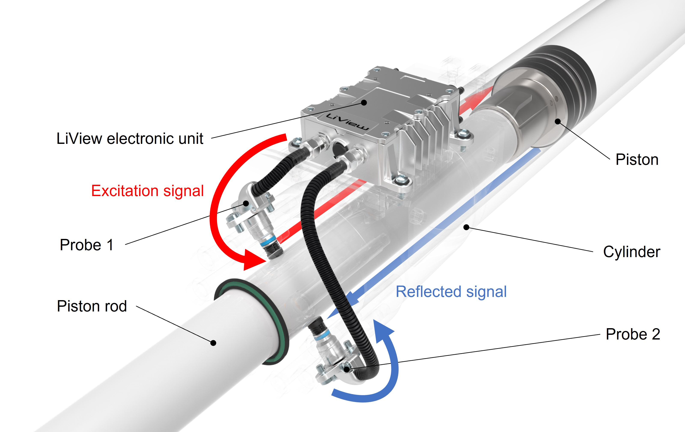

# Deep Learning-Based Position Detection for Hydraulic Cylinders Using Scattering Parameters

This repository contains the implementation of the research paper titled ["Deep Learning-Based Position Detection for Hydraulic Cylinders Using Scattering Parameters"](https://arxiv.org/abs/2209.01010), published in the journal [Expert Systems with Applications](https://doi.org/10.1016/j.eswa.2023.120892).



## Requirements

To install requirements:

```setup
pip install -r requirements.txt
```

## Data and Models

The dataset used in this study is confidential, but we have included the trained models in this repository.

The model names are abbreviated as follows:

- NN: Neural Network
- CNN: Convolutional Neural Network
- CVNN: Complex-Valued Neural Network
- CVCNN: Complex-Valued Convolutional Neural Network
- bn: batch normalisation
- fe: frequency encoding
- concat: concatenation


## Training

The models were trained using Jupyter notebooks located in the './code' folder. Each notebook corresponds to the respective model abbreviation mentioned above.


## Evaluation

The evaluation results for all models are summarized in the notebook './code/summary.ipynb'.

## Results

Our best-performing model, a complex-valued CNN with Frequency Encoding, demonstrates a significant improvement in accuracy, reducing the error by 1/12 compared to the traditional physical model.

